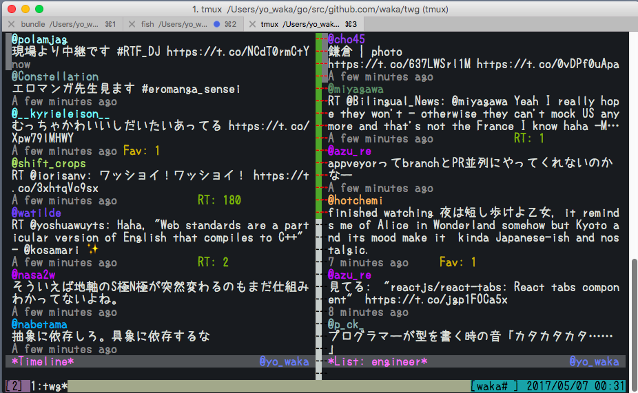

# twg

twg is twitter client for cli, written by golang.

## Screenshot



## Install

```
$ go get -u github.com/waka/twg
```

or download binary file from [this link](https://github.com/waka/twg-go/releases/download/v0.1.0/twg).

## Start options

```
$ twg -h
Usage:
  twg [OPTIONS]

Application Options:
  -m, --mode=    you can select timeline(default) or mentions or list:slug
  -t, --tweet=   update your status, and finish
  -r, --reload   do auto reload by 2 minutes
  -v, --version

Help Options:
  -h, --help     Show this help message
```

## Key binds

| Key             | Action                               |
|:----------------|:-------------------------------------|
| ctrl + q        | Quit app                             |
| ctrl + r or r   | Reload tweets                        |
| up or k         | Up cursor                            |
| down or j       | Up cursor                            |
| gg              | Move cursor to top                   |
| G               | Move cursor to bottom                |
| :               | Command mode                         |
| ctrl + c or Esc | Switch to Normal mode and clear keys |

## Command mode

- `:tl` - show home timeline
- `:mentions` - show mentions tweets
- `:list {slug}` - show list timeline
- `:tweet {text}`, `:t {text}` - post tweet
- `:reply {text}`, `:r {text}` - reply to selected tweet
- `:fav`, `:f` - fav to selected tweet
- `:rt` - retweet to selected tweet
- `:q` - quit app

## Reset access token

Remove configuration file.

```
$ rm ~/.twg
```

## Build in local machine

twg use [dep](https://github.com/golang/dep) to resolve dependencies.

```
$ make deps
$ make
$ ./bin/twg
```
